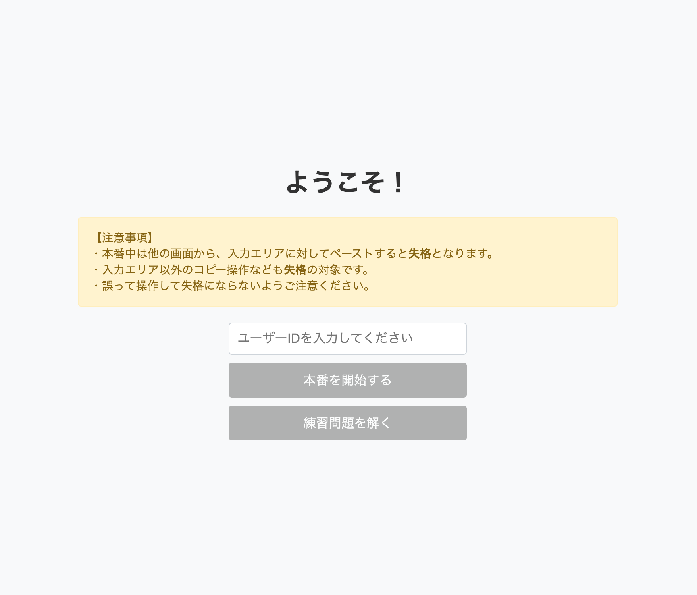
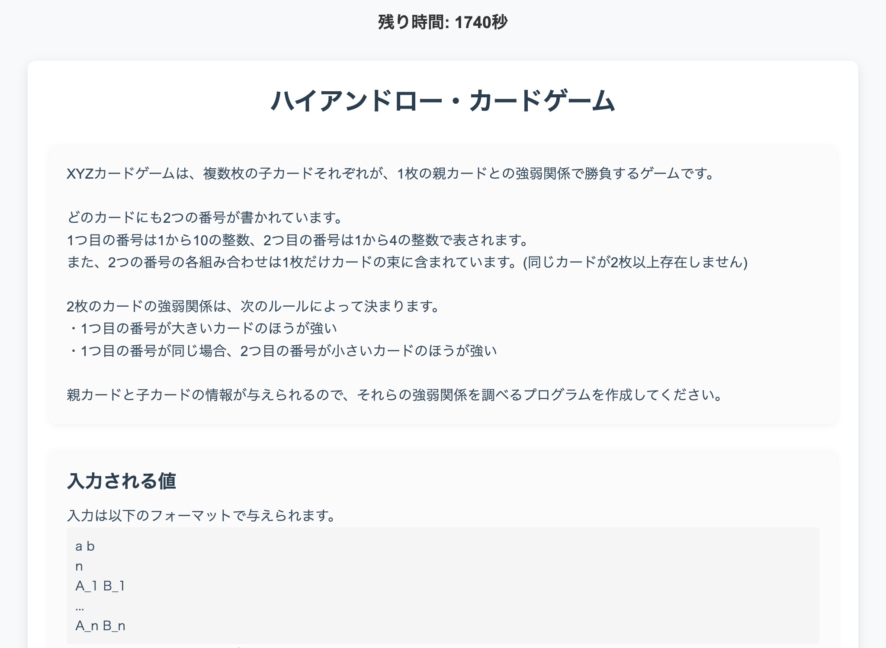
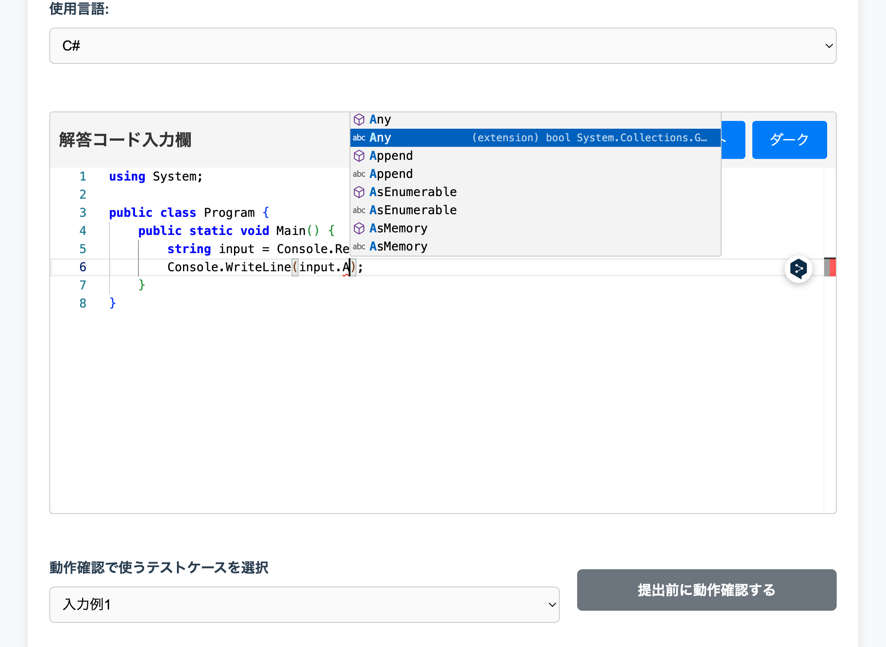
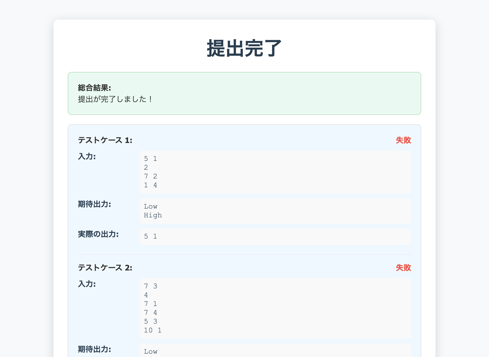

# 競技プログラミング勉強アプリ

ローカル環境で **C# / TypeScript** のコードを書き、テストケースで即時採点できる学習用アプリです。  
フロントエンド（React + Monaco Editor）、バックエンド（Node.js/Express）、静的解析 & 補完 API（ASP.NET Core + Roslyn）の三層構成で動作します。  
競技プログラミングの本番さながらの **失格判定・制限時間管理・コピー／ペースト監視** も備えています。

## スクリーンショット

| ログイン                    | 問題                   | エディタ + 補完例            | 採点結果                     |
| --------------------------- | ---------------------- | ---------------------------- | ---------------------------- |
|  |  |  |  |

## フォルダ構成

```text
local-competitive-app/
├─ package.json           # ルート：API/Build スクリプト集約
├─ tsconfig.json
├─ server/                # Node.js + Express (コード実行・判定)
│   ├─ server.ts
│   ├─ runCode.ts
│   └─ types.ts
├─ code-analysis-server/  # ASP.NET Core + Roslyn (補完・診断 API)
│   └─ CodeAnalysisServer/
│       ├─ Controllers/
│       ├─ Services/
│       └─ ...
├─ client/                # Vite + React + TypeScript (UI)
│   ├─ src/
│   │   ├─ components/
│   │   └─ data/
│   |   └─ ...
│   └─ public/
├─ temp/                  # 一時ビルド/実行ファイル
└─ results/               # 提出結果ログ
```

## 主な機能

| 機能                | 説明                                                   |
| ------------------- | ------------------------------------------------------ |
| Monaco Editor 統合  | C#/TS シンタックスハイライト・補完・コードアクション   |
| Roslyn 解析 API     | エラー/警告診断・Hover 情報・Signature Help・Quick Fix |
| テストケース実行    | 複数ケース一括採点 / 公開テストの個別実行              |
| 制限時間 & 失格判定 | コピー/ペースト監視・タイムアップ・手動失格            |
| 言語切替            | プルダウンで C# / TypeScript を即時切替                |
| 完了画面            | 個々のテスト結果 & 総合判定を表示・JSON 保存           |

## クイックスタート

> **前提ソフトウェア**
>
> * **Node.js 18+**
> * **.NET SDK 8.0+**
> * Git / Bash など

```bash
# 1. クローン
git clone https://github.com/dahutos2/local-competitive-app.git
cd local-competitive-app

# 2. 依存関係
npm install            # ルート（Express & スクリプト群）
cd client && npm install   # フロント
cd ..

# 3. .NET 依存を復元
cd code-analysis-server/CodeAnalysisServer
dotnet restore
cd ../../

# 4. 開発モード同時起動（React / Express / Roslyn API）
npm run dev
# ├─ http://localhost:3000 : Vite Dev Server
# ├─ http://localhost:4000 : API サーバ
# └─ http://localhost:6000 : C# 解析サーバ（Swagger あり）
```

### 本番ビルド

```bash

# バンドル + Release ビルド
npm run build
# ├─ tsc -b && vite build          : client を client/dist に出力
# ├─ tsc -p ./server/tsconfig.json : TypeScript → JS 変換
# └─ dotnet build -c Release       : Roslyn API Release ビルド

# 起動
npm run release
# ├─ http://localhost:3000 : Vite preview
# ├─ http://localhost:4000 : API サーバ
# └─ http://localhost:6000 : C# 解析サーバ
```

---

## 主要スクリプト一覧

| コマンド                     | 役割                                              |
| ---------------------------- | ------------------------------------------------- |
| **開発**                     |                                                   |
| `npm run dev`                | 解析 API + サーバ + Vite を並列起動               |
| `npm run server:dev`         | `nodemon` + `ts-node` で Express をホットリロード |
| `npm run client:dev`         | `cd client && vite`                               |
| `npm run analysis:dev`       | Roslyn API (`dotnet run`)                         |
| **本番**                     |                                                   |
| `npm run build`              | 3 サービスを Release ビルド                       |
| `npm run release`            | Release 起動を並列実行                            |
| 個別 `*:build` / `*:release` | 各レイヤーのみビルド or 起動                      |


---

## ポート & プロキシ

| 役割            | 既定ポート | 備考                                           |
| --------------- | ---------- | ---------------------------------------------- |
| Vite Dev Server | **3000**   | `vite.config.ts` で `/api` を :4000 にプロキシ |
| Express API     | **4000**   | `/api/*`                                       |
| C# Roslyn API   | **6000**   | `Program.cs` で `Kestrel` 6000                 |

変更する場合は各ソースのポート参照を合わせてください。

## 開発メモ

* **便利コマンド**
    
    ```bash
    # vite + react + typescript のプロジェクトを作成
    npm create vite@latest client -- --template react-ts
    ```

* **失格判定**

  * Monaco 内以外での <kbd>Ctrl/Cmd</kbd>+<kbd>C/V</kbd> → `/api/disqualify`
  * 時間超過・ボタン操作でも失格をトリガー

* **問題データ**

  * `client/src/data/tasks.json` : 本番問題
  * `docs/task.md` : 本番問題の解説
  * `client/src/data/practiceTasks.json` : 練習用